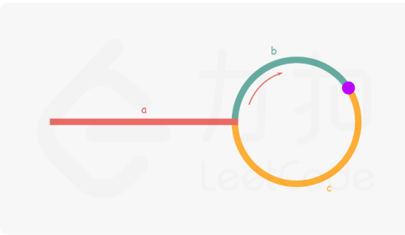

# 思路

参考下图，假设 slow 和 fast 在环内紫色点相遇。

那么 slow 此时走的距离是 a+b, 
而 fast 走的距离是 a+b+n(b+c), n 代表 fast 在环内多走的圈数(n>=1)
而由于 slow 每次走一个单位, fast 每次走两个单位, 那么有如下关系:
2(a+b) = a+b+n(b+c) 
得到 a = n(b+c)-b

这个关系揭露了如下结论:
当 slow 和 fast 相遇后, 再额外使用一个 ptr 指针. 起始它指向头部, 然后 ptr 和 slow 同时开始移动,
最终 slow 会和 ptr 在入口点相遇.

具体的来说:
由于 a = n(b+c)-b = (n-1)(b+c) + c, 也就是说只要 slow 在环内再走 n-1 圈, 
加上目前的一圈还剩下的 c，就等于从头部到入口点的距离。
